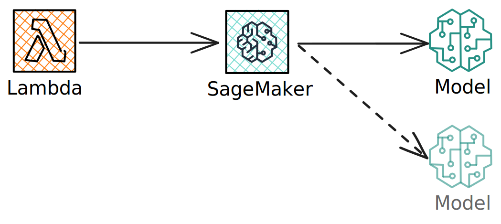

# Automatic Expense Reporting
This CDK project deploys a multi-modal LLM to AWS to help creating expense reports.
It uses the ["LayoutLM for Invoices"](https://huggingface.co/impira/layoutlm-invoices) model from HuggingFace Hub, which is a variant of the popular multi-modal LayoutLM model trained to understand documents and fine-tuned on invoices.

Using this model, you can quickly extract the most relevant information for an expense report such as company, address, total, etc. by simply asking a set of questions.

## Deploying the model
You need an AWS account to deploy this project.
> [!WARNING]  
> Short usage should be covered by the AWS Free Tier, but keeping this stack running will incur costs.

Prerequisites: You need Docker installed on your local machine.

1. Install the CDK using your package manager or by following [this guide](https://docs.aws.amazon.com/cdk/v2/guide/getting_started.html#getting_started_install)
2. Clone the parent repo
```bash
git clone ...
cd .../auto_expense
```
3. Create a virtualenv to install all dependencies
```bash
virtualenv .venv
source .venv/bin.activate
# use requirements-dev.txt if you want to develop
pip install -r requirements.txt
``` 
4. Bootstrap the CDK into your AWS account and deploy the app
```bash
cdk bootstrap
cdk deploy # -c x=y
```
See [Parameters](#parameters) for a list of parameters you can pass during deployment.

After the deployment (which can take a while), a function URL will be printed to the CLI, which can be invoked to query the model.

> [!WARNING]  
> There is currently no authentication required to invoke the model. Don't deploy this to production without reading [this section](#necessary-production-changes)!

## Parameters

# Usage
To invoke the model, simply send a JSON request to the function url printed at the end of deployment.
It should at least contain a single `image` key with a publicly accessible image url as its value:

```bash
curl -H "Content-type: application/json"  -XPOST -d '{"image":"https://huggingface.co/spaces/impira/docquery/resolve/2359223c1837a7587402bda0f2643382a6eefeab/contract.jpeg"}' '<function-url>'
```
The above example will query the model using an example from the HuggingFace hub and a set of predetermined questions.
It will return a JSON containing the amount, merchant and the date of the invoice.

You can also ask your own questions of the model by sending a `question` to it:

```python
import requests

FUNCTION_URL = ""

data = {
    "image": "https://huggingface.co/spaces/impira/docquery/resolve/2359223c1837a7587402bda0f2643382a6eefeab/contract.jpeg",
    "question": "What is the total amount?"
}

r = requests.post(FUNCTION_URL, json=data)
print(r.json())
```

When you invoke the endpoint, it might return an error depending on the input and/or the current state of the model (e.g. not being fully loaded).
Refer to the [Sagemaker documentation](https://docs.aws.amazon.com/sagemaker/latest/APIReference/API_runtime_InvokeEndpoint.html#API_runtime_InvokeEndpoint_Errors) for a list of response codes you can expect.

# Stack

The deployed application looks roughly like this:
A Lambda function is used as the front-end to accept user queries and send them to the model.

The model is hosted on Sagemaker using an inference endpoint. By default it is configured to scale up as soon as a certain amount of requests are registered in the span of a second.
If the threshold of five requests per second (per instance) is crossed for over 300 seconds, another model instance is spun up to accommodate the load.
If traffic subsides, additional instances will be scaled out after a cool down period of 300 seconds.

## Model Container
By default, the container provided by AWS/HuggingFace doesn't contain the necessary OCR software to run inference.
We therefore need to add these dependencies to the container during deployment.
See the `docker` folder for more details.

## Lambda Function
To simplify usage and act as a layer between the model endpoint and the end-user, a Lambda function is provided in the `lambda` folder.
It acts as a rate-limiter and provides an easy way to invoke the model using a set of pre-defined questions.

# Necessary production changes
This stack is intended as a proof of concept and should not be deployed in production for a number of reasons:

1. There is no security implemented on the Lambda endpoint. A proper deployment should be using token-based/oauth authentication. Alternatively, activating AWS IAM authentication can also keep the function from being abused by malicious parties.
2. The Lambda function acts as a rate-limiter, with the default concurrency setting of 10 maxing out at 100 requests per second. This might need to be increased for a production setting.
3. The app only allows submitting images by making them publicly available and providing a link to the model. This link is also currently not sanitized and should be preprocessed before being send to the model.

# ToDos
I added a small test website that can be deployed with the stack to allow testing the endpoint.
Unfortunately, the CDK doesn't really allow deploying static content to buckets with a fixed name (AFAIK), so I wasn't able to automate this portion of the workflow.